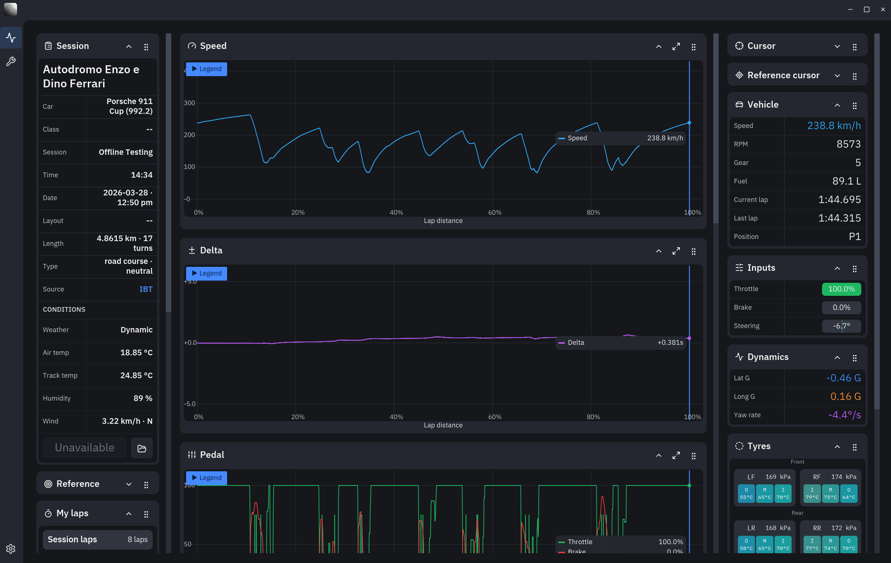

# Chiaroscuro

An iRacing telemetry viewer built with Rust and the Iced GUI framework.

Chiaroscuro is a real-time telemetry viewer designed exclusively for iRacing. It
provides dedicated Telemetry and Car setup screens for live vehicle, session,
lap, tyre, and setup data.

  

## Project Scope

Chiaroscuro currently supports **iRacing only**. Support for Assetto Corsa,
Assetto Corsa Competizione, Assetto Corsa EVO, GT7, or other simulators may be
considered in the future, but is not part of the current scope. Until then,
new protocol, telemetry, UI, and data-model work should be designed around the
iRacing SDK instead of introducing speculative multi-simulator abstractions.

The desktop links the `chiaro_irsdk` crate directly and reads iRacing's
shared-memory telemetry in a background subscription. No relay process or UDP
transport is required.

## Features

- Real-time telemetry data visualization
- Vertical navigation between customizable Telemetry and Car setup screens
- iRacing SDK telemetry integration
- Lightweight and fast performance
- iRacing-focused vehicle, session, lap, and tyre data model

## Contributing

Contributions are welcome! Please open an issue or submit a pull request for any bugs or feature requests.

## Implementation Status

The desktop shell, Telemetry screen, and Car setup screen are under active
development. Live iRacing SDK telemetry is available on Windows through the
in-process shared-memory client. IBT recordings remain available without a live
iRacing connection.

## License

This project is licensed under the GNU General Public License, version 3 or later.

- [GPL-3.0-or-later](LICENSE)
